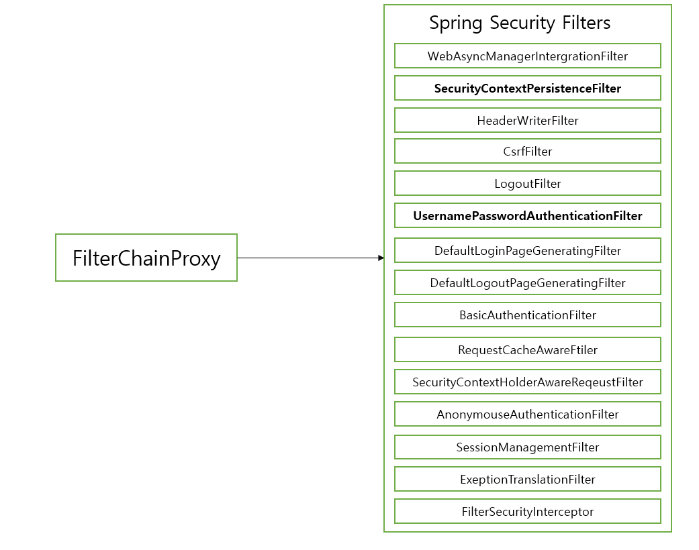
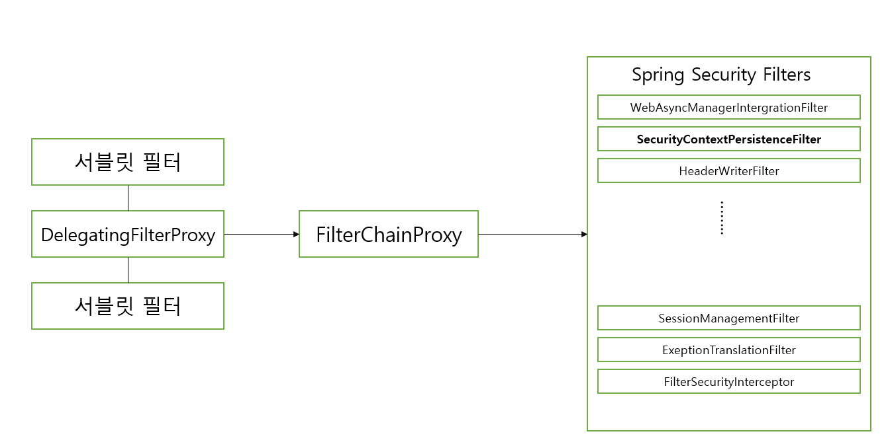
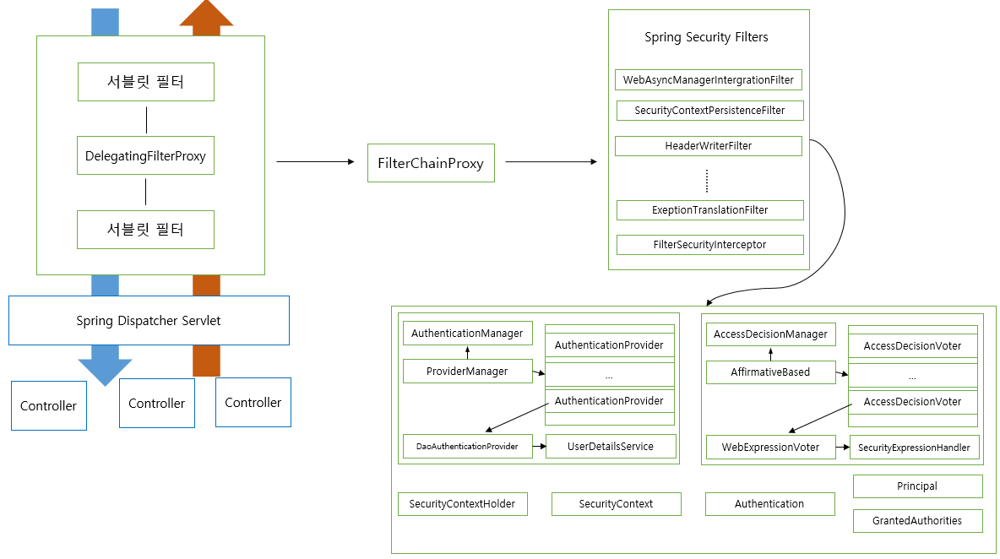

# spring-security
      
## SecurityContextHolder와 Authentication


[출처]https://docs.spring.io/spring-security/site/docs/5.3.0.RELEASE/reference/html5/#servlet-authentication-securitycontextholder

 * SecurityContextHolder
   * SecurityContext 제공, 기본적으로 ThreadLocal을 사용한다.
   ```java
   final class ThreadLocalSecurityContextHolderStrategy implements SecurityContextHolderStrategy {
    private static final ThreadLocal<SecurityContext> contextHolder = new ThreadLocal();

    ThreadLocalSecurityContextHolderStrategy() {
    }

    public void clearContext() {
        contextHolder.remove();
    }

    public SecurityContext getContext() {
        SecurityContext ctx = (SecurityContext)contextHolder.get();
        if (ctx == null) {
            ctx = this.createEmptyContext();
            contextHolder.set(ctx);
        }

        return ctx;
    }

    public void setContext(SecurityContext context) {
        Assert.notNull(context, "Only non-null SecurityContext instances are permitted");
        contextHolder.set(context);
    }

    public SecurityContext createEmptyContext() {
        return new SecurityContextImpl();
     }
   }

* SecurityContext
   * Authentication 제공
* Authentication - Principal과 Credentials, GrantAuthority  제공.
    * Principal 
        * “누구"에 해당하는 정보. 
        * UserDetailsService에서 리턴한 그 객체(UserDetails 타입)
    * credentials
        * 비밀번호라고 생각하면 됩니다. 인증 후에는 null
    * GrantAuthority
        * “ROLE_USER”, “ROLE_ADMIN”등 Principal이 가지고 있는 “권한”을 나타낸다.
        * 인증 이후, 인가 및 권한 확인할 때 이 정보를 참조한다.
    * UserDetails
        * 애플리케이션이 가지고 있는 유저 정보와 스프링 시큐리티가 사용하는 Authentication 객체 사이의 어댑터.
    * UserDetailsService
        * 유저 정보를 UserDetails 타입으로 가져오는 DAO (Data Access Object) 인터페이스.

## AuthenticationManager와 Authentication
Spring security의 인증(authentication)은 `AuthenticationManager`가 한다.
```java
package org.springframework.security.authentication;

import org.springframework.security.core.Authentication;
import org.springframework.security.core.AuthenticationException;

/**
 * Processes an {@link Authentication} request.
 *
 * @author Ben Alex
 */
public interface AuthenticationManager {
	// ~ Methods
	// ========================================================================================================

	/**
	 * Attempts to authenticate the passed {@link Authentication} object, returning a
	 * fully populated <code>Authentication</code> object (including granted authorities)
	 * if successful.
	 * <p>
	 * An <code>AuthenticationManager</code> must honour the following contract concerning
	 * exceptions:
	 * <ul>
	 * <li>A {@link DisabledException} must be thrown if an account is disabled and the
	 * <code>AuthenticationManager</code> can test for this state.</li>
	 * <li>A {@link LockedException} must be thrown if an account is locked and the
	 * <code>AuthenticationManager</code> can test for account locking.</li>
	 * <li>A {@link BadCredentialsException} must be thrown if incorrect credentials are
	 * presented. Whilst the above exceptions are optional, an
	 * <code>AuthenticationManager</code> must <B>always</B> test credentials.</li>
	 * </ul>
	 * Exceptions should be tested for and if applicable thrown in the order expressed
	 * above (i.e. if an account is disabled or locked, the authentication request is
	 * immediately rejected and the credentials testing process is not performed). This
	 * prevents credentials being tested against disabled or locked accounts.
	 *
	 * @param authentication the authentication request object
	 *
	 * @return a fully authenticated object including credentials
	 *
	 * @throws AuthenticationException if authentication fails
	 */
	Authentication authenticate(Authentication authentication)
			throws AuthenticationException;
}
```
인자로 받은 Authentication
 - 사용자가 입력한 인증에 필요한 정보(username, password)로 만든 객체.
 
> AuthenticationConfiguration의 AuthenticationManagerDelegator

유효한 인증인지 확인
 * 사용자가 입력한 password가 UserDetailsService를 통해 읽어온 UserDetails 객체에 들어있는 password와 일치하는지 확인
 * 해당 사용자 계정이 잠겨 있진 않은지, 비활성 계정은 아닌지 등 확인

## Authencation과 SecurityContextHodler
AuthenticationManager가 인증을 마친 뒤 리턴 받은 Authentication 객체의 행방은 어디로 갈까요?

 * UsernamePasswordAuthenticationFilter
   * 폼 인증을 처리하는 시큐리티 필터
   * 인증된 Authentication 객체를 SecurityContextHolder에 넣어주는 필터
   > AbstractAuthenticationProcessingFilter의 successfulAuthentication
 * SecurityContextPersistenceFilter
   * SecurityContext를 HTTP session에 캐시(기본 전략)하여 여러 요청에서 Authentication을 공유할 수 있 공유하는 필터.
   * SecurityContextRepository를 교체하여 세션을 HTTP session이 아닌 다른 곳에 저장하는 것도 가능하다.


## Spring security가 제공하는 Filter와 FilterChainProxy
스프링 시큐리티가 제공하는 필터들은 FilterChainProxy를 통해 호출된다.


## DelegatingFilterProxy와 FilterChainProxy
 * DelegatingFilterProxy
   * 서블릿 컨테이너에 등록되는 필터.
   * 서블릿 필터 처리를 스프링에 들어있는 빈으로 위임하고 싶을 때 사용하는 서블릿 필터.
   * 타겟 빈 이름을 설정한다.
   * 스프링 부트 없이 스프링 시큐리티 설정할 때는 AbstractSecurityWebApplicationInitializer를 사용해서 등록.
   * 스프링 부트를 사용할 때는 자동으로 등록 된다. (SecurityFilterAutoConfiguration)
 * FilterChainProxy
   * 보통 "springSecurityFilterChain" 이라는 이름의 빈으로 등록.


## AccessDecisionManager
AccessDecisionManager는 3가지 구현체가 있다.
 * AffirmativeBased: 여러 Voter중에 한명이라도 허용하면 허용.(기본 전략 값)
 * ConsensusBased: 다수결
 * UnanimousBased: 만장일치
 
AccessDecisionVoter
  * 해당 Authentication이 특정한 Object에 접근할 때 필요한 ConfigAttributes를 만족하는지 확인한다.
  * WebExpressionVoter: 웹 시큐리티에서 사용하는 기본 구현체, ROLE_Xxxx가 매치하는지 확인.
  * RoleHierarchyVoter: 계층형 ROLE 지원. ADMIN > MANAGER > USER
  ```java
    public AccessDecisionManager accessDecisionManager() {
        RoleHierarchyImpl roleHierarchy = new RoleHierarchyImpl();
        roleHierarchy.setHierarchy("ROLE_ADMIN > ROLE_USER");

        DefaultWebSecurityExpressionHandler handler = new DefaultWebSecurityExpressionHandler();
        handler.setRoleHierarchy(roleHierarchy);

        WebExpressionVoter webExpressionVoter = new WebExpressionVoter();
        webExpressionVoter.setExpressionHandler(handler);

        return new AffirmativeBased(Arrays.asList(webExpressionVoter));
    }

    public SecurityExpressionHandler<FilterInvocation> expressionHandler() {
        RoleHierarchyImpl roleHierarchy = new RoleHierarchyImpl();
        roleHierarchy.setHierarchy("ROLE_ADMIN > ROLE_USER");

        DefaultWebSecurityExpressionHandler handler = new DefaultWebSecurityExpressionHandler();
        handler.setRoleHierarchy(roleHierarchy);

        return handler;
    }
  ```
  * .... 여러 구현 가능


## FilterSecurityInterceptor
 * AccessDecisionManager를 사용하여 Access Control 또는 예외 처리 하는 필터.
 * 대부분의 경우 FilterChainProxy의 마지막 필터.
> AbstractSecurityInterceptor의 beforeInvocation

## ExceptionTranslationFilter
Filter chain에서 발생하는 AccessDeniedException과 AuthenticationException을 처리하는 필터
 * AuthenticationException 발생 시 AuthenticationEntryPoint 실행
    * AbstractSecurityInterceptor 하위 클래스(예, FilterSecurityInterceptor)에서 발생하는 예외만 처리.
 * AccessDeniedException 발생 시 
    * 익명 사용자라면 AuthenticationEntryPoint 실행
    * 익명 사용자가 아니면 AccessDeniedHandler에게 위임
    
    
## Spring security architecture 정리

